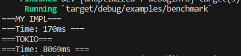
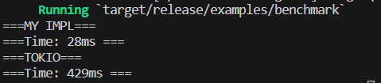

# Fiber Runtime

A light-weighted async runtime for multithreads. Like fibers/green threads.  

**Mainly for learning purposes**

## Usage

```rust
use fiber_runtime::fiber_main;

async fn demo() {
    println!("Hello world");
}
fiber_main! {
    let universe = async {
        demo().await;
        println!("done demo");
        42
    }.await;
    assert_eq!(universe, 42);
}
```
See examples for more.  
You can use crate `with_locals` to do Continuation-Passing Style(CPS) programming, like what you will do in JavaScript.  

## Examples

- `cargo run --example min`  Minimal example  
- `cargo run --example return_value`  Async with non `()` return value  
- `cargo run --example sleep`  Async sleep example  
- `cargo run --release --example racing`  Multiple threads running light works, found no racing of Task  
- `cargo run --release --example heavy_load`  Multiple threads running CPU intensive works, showing little idle time & overhead for a worker thread
- `cargo run --release --example benchmark`  Compare with Tokio (not so fair actually)
- `cargo run --release --example macros`  See how to use macros (some are from `futures`), and see how tasks got dropped if not finished in `select!`
- `cargo run --release --example memory_usage`  Test memory usage

## Features / Advantages / Optimizations

- No Mutex
- Light-weighted (no long spinning, ~140 Bytes memory overhead per future)
- **Accepts non `()` return value from future**, with dynamic typing
- Optimized for running one task only (so you get a higher performance if futures are combined)
- Easy-to-use macro(s)

## Design

Signal wakeup via MPMC channel provided by `crossbeam`.  
Spawner(as producer) spawns tasks from futures, polls the channel, dispatches tasks to each Executor(as consumer) running on each thread.  
You may wonder why there is no Signal to wait for, but it is an encapsulation of a real operating system SIG. In this implementation, the SIG is handled by the thread::park(), called by the channel receiver, more efficiently.

### Polling of the channel

Blocks the thread. It will spin for a very short time (**try to avoid expensive syscall**), then (if there's no new task in the channel) call thread::park() to hang the thread until the OS wakes it up.  
For Unix/FreeBSD/Android, this process is done by futex(fast userspace mutex) primitive, which is **faster than the version implemented by conditional variables(Condvar)**.  
Thread-per-core is recommended, as they are equivalently accepting tasks if available.

**That is to say, CPU resource is available for others when idling.**

### TODOs

- Combinators like `.then()` `.and_then()` `.map()`
- Worker pool

### Benchmarks

### Block on Many Futures


### Block on Many Futures, with `--release` enabled
