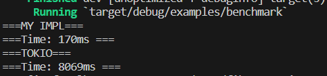
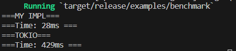

# Fiber Runtime

A lightweight async runtime for multiple threads. Like fibers/green threads.

**Mainly for learning purposes**

## Usage

```rust
use fiber_runtime::fiber_main;

async fn demo() {
    println!("Hello world");
}
fiber_main! {
    let universe = async {
        demo().await;
        println!("done demo");
        42
    }.await;
    assert_eq!(universe, 42);
}
```

See examples for more.
You can use crate `with_locals` to do Continuation-Passing Style(CPS) programming, like what you will do in JavaScript.

## Examples

- `cargo run --example min`  Minimal example
- `cargo run --example return_value`  Async with non `()` return value
- `cargo run --example sleep`  Async sleep example
- `cargo run --example echo_server`  **TCP echo server driven by the I/O reactor**
- `cargo run --release --example racing`  Multiple threads running light works, found no racing of Task
- `cargo run --release --example heavy_load`  Multiple threads running CPU intensive works, showing little idle time & overhead for a worker thread
- `cargo run --release --example benchmark`  Compare with Tokio (not so fair actually)
- `cargo run --release --example macros`  See how to use macros (some are from `futures`), and see how tasks got dropped if not finished in `select!`
- `cargo run --release --example memory_usage`  Test memory usage

## Features / Advantages / Optimizations

- Lightweight (~140 bytes memory overhead per future, no long spinning)
- **`block_on` returns typed results** via a channel — no `Box<dyn Any>` or `downcast`
- **I/O reactor** backed by `mio` (epoll/kqueue/IOCP) — one background thread drives all async I/O
- Optimized for running one task only (so you get a higher performance if futures are combined)
- Easy-to-use macro(s)

## Design

### Workflow

```text
                 ┌───────────────────────────────────────────────────────────────┐
                 │                      Executor Thread                          │
                 │                                                               │
 Spawner ──spawn──>  [ Task Queue  (crossbeam MPMC channel) ]                    │
                 │          │                              ▲                      │
                 │          │ recv                         │                      │
                 │          ▼                              │                      │
                 │     ┌─────────┐                        │                      │
                 │     │  poll() │                        │                      │
                 │     └────┬────┘                        │                      │
                 │     ┌────┴────┐                        │                      │
                 │  Ready     Pending                     │                      │
                 │   │           │                        │                      │
                 │  done    future stores Waker            │                      │
                 │                │                        │                      │
                 └────────────────┼────────────────────────┼──────────────────────┘
                                  │                        │
              ┌───────────────────┼────────────────────────┼─────────────────┐
              │  Reactor Thread   │                        │                 │
              │                   ▼                        │                 │
              │        ┌──────────────────┐                │                 │
              │        │  mio::Poll       │                │                 │
              │        │  (epoll / kqueue │                │                 │
              │        │  / IOCP)         │                │                 │
              │        └────────┬─────────┘                │                 │
              │                 │ OS reports readiness      │                 │
              │                 ▼                           │                 │
              │          waker.wake()  ────────────────────►│                 │
              │          (re-enqueues task)       task re-enters queue        │
              │                                                              │
              └──────────────────────────────────────────────────────────────┘
```

**Key insight**: the Reactor replaces "one OS thread per I/O wait" (like `TimerFuture`)
with a single background thread that monitors *all* I/O sources via the OS.
This is why async scales to thousands of concurrent connections.

### Components

| Module | Role |
|---|---|
| `executor` | Pulls tasks from the channel, polls futures, re-enqueues on `Pending` |
| `reactor` | Background thread running `mio::Poll`; wakes tasks when I/O is ready |
| `tcp` | Async `TcpListener` / `TcpStream` — thin wrappers that register with the reactor |
| `timer_future` | Thread-per-timer approach (from the async book, kept for contrast) |

### Polling of the channel

Blocks the thread. It will spin for a very short time (**try to avoid expensive syscall**), then (if there's no new task in the channel) call thread::park() to hang the thread until the OS wakes it up.
For Unix/FreeBSD/Android, this process is done by futex (fast userspace mutex) primitive, which is **faster than the version implemented by conditional variables (Condvar)**.
Thread-per-core is recommended, as they are equivalently accepting tasks if available.

**That is to say, CPU resource is available for others when idling.**

### Limitations

- **`TimerFuture` spawns an OS thread per timer**: this is borrowed from the async book for simplicity. Production runtimes use timer wheels or a single background thread. Contrast this with the reactor-driven `echo_server` example to see the difference.
- **Single waker per I/O source**: concurrent `read` + `write` on the same `TcpStream` is not supported (fine for request/response patterns like echo).

### TODOs

- Combinators like `.then()` `.and_then()` `.map()`
- Worker pool
- Using Type Alias Impl Trait(TAIT) to avoid redundant boxing/allocations (only available in rust nightly channel)
  - Which will make rust be able to represent Higher-Kinded Type(HKT) pattern :)

### Benchmarks

### Block on Many Futures


### Block on Many Futures, with `--release` enabled

